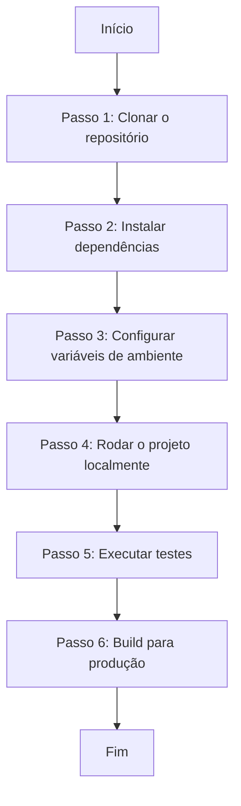

# Welcome to MkDocs

```mermaid
graph TD
    A[Início] --> B[Passo 1: Clonar o repositório]
    B --> C[Passo 2: Instalar dependências]
    C --> D[Passo 3: Configurar variáveis de ambiente]
    D --> E[Passo 4: Rodar o projeto localmente]
    E --> F[Passo 5: Executar testes]
    F --> G[Passo 6: Build para produção]
    G --> H[Fim]
```
